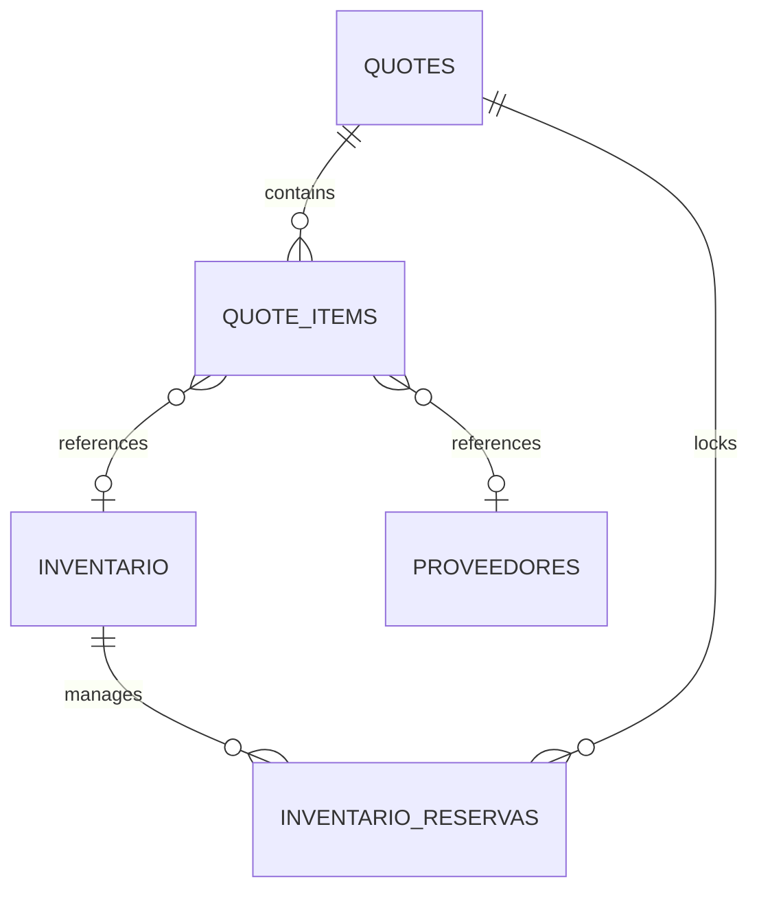

# Especificación Técnica — Módulo Cotizaciones Cliente

Este documento define la arquitectura y el diseño técnico para la implementación del módulo de **Cotizaciones Cliente** dentro del CRM de CARGAR S.A.S. Se ha seleccionado la **Opción A (Extensión de Módulos Existentes)** para reutilizar las tablas `quotes` y `quote_items`, integrándolas con los requerimientos específicos de negocio.

---

## 1. Modelo de Datos y Relaciones

Reutilizamos e integramos las tablas de la base de datos PostgreSQL existentes con la siguiente semántica:

### Tabla `quotes` (Cabecera)
* `id` (`uuid`): Clave primaria.
* `quote_number` (`character varying`): Número de cotización (formato `QT-XXXXXX`).
* `opportunity_id` (`uuid`): FK a `opportunities` (opcional).
* `company_id` (`uuid`): FK a `companies` (Cliente).
* `contact_id` (`uuid`): FK a `contacts`.
* `status` (`character varying`): Estados: `'draft'` (Borrador), `'sent'` (Enviado), `'accepted'` (Aceptado), `'rejected'` (Rechazado), `'expired'` (Expirado).
* `subtotal`, `tax_rate`, `tax_amount`, `total` (`numeric`).
* `notes` (`text`).
* `pdf_url` (`text`).
* `created_by` (`uuid`): Vendedor que crea la cotización.

### Tabla `quote_items` (Detalle de Ítems)
* `id` (`uuid`): Clave primaria.
* `quote_id` (`uuid`): FK a `quotes` (ON DELETE CASCADE).
* `description` (`text`): Descripción detallada del producto o servicio cotizado.
* `quantity` (`numeric`): Cantidad cotizada.
* `unit_price` (`numeric`): Precio unitario final cobrado al cliente.
* `discount` (`numeric`): Descuento en porcentaje aplicado sobre el ítem.
* `origen` (`character varying`): `'inventario'` (catálogo) o `'proveedor'` (cotización a proveedor).
* `inventario_id` (`uuid`): FK a la tabla `inventario` (opcional).
* `proveedor_id` (`uuid`): FK a la tabla `proveedores` (opcional).
* `costo_base` (`numeric`): Costo de compra del ítem.
* `porcentaje_incremento` (`numeric`): Markup aplicado sobre el costo (por defecto `23.00`%).
* `autorizado_por` (`uuid`): FK a `users` (el administrador que autoriza un descuento por debajo del margen permitido).
* `justificacion_descuento` (`text`): Justificación escrita si se requiere autorización.

### Tabla `inventario_reservas` (Reservas Soft)
* `id` (`uuid`): Clave primaria.
* `inventario_id` (`uuid`): FK a `inventario`.
* `quote_id` (`uuid`): FK a `quotes`.
* `quote_item_id` (`uuid`): FK a `quote_items`.
* `cantidad_reservada` (`integer`): Cantidad reservada.
* `estado` (`character varying`): `'activa'` o `'liberada'`.

---

## 2. Reglas de Negocio Backend

### A. Margen Mínimo (Markup) del 23% e Intervención de Descuento
* **Cálculo:**
  $$\text{Precio Sugerido} = \text{Costo Base} \times \left(1 + \frac{\text{Porcentaje Incremento}}{100}\right)$$
  Donde el `porcentaje_incremento` mínimo debe ser del `23.00`%.
* **Descuentos y Autorizaciones:**
  Si el vendedor aplica un descuento (`discount > 0`) tal que el precio neto resultante sea menor que el $\text{Precio Sugerido}$ con markup del 23% (o si directamente reduce el `porcentaje_incremento` por debajo del 23%), el sistema requerirá de forma obligatoria que el campo `autorizado_por` tenga el ID de un usuario administrador y que exista una `justificacion_descuento`.

### B. Gestión de Stock e Ítems no Disponibles
* Si el origen del ítem es `'inventario'`, se consulta el stock disponible real:
  $$\text{Stock Disponible} = \text{Stock Físico} - \text{Reservas Activas de Otras Cotizaciones}$$
* Si la cotización del cliente solicita más unidades que el stock disponible en inventario:
  * El backend exigirá una cotización a proveedor asociada (`proveedor_id` y `origen = 'proveedor'`).
  * No se puede cotizar a cliente lo que no está ni en stock físico disponible ni respaldado por una cotización de proveedor.

### C. Reserva Soft y Transacción Atómica en PostgreSQL
* **Creación/Actualización (Borrador/Creado):** Al guardar ítems de `'inventario'`, se crea una reserva soft en `inventario_reservas` en estado `'activa'` por la cantidad cotizada.
* **Transacción Atómica de Aceptación:**
  Al actualizar el estado de la cotización cliente a `'accepted'`:
  1. Se liberan las reservas de `inventario_reservas` asociadas a esta cotización cambiándolas a `'liberada'`.
  2. Se deduce el stock físico en la tabla `inventario` restando la cantidad entregada:
     $$\text{stock\_actual} = \text{stock\_actual} - \text{cantidad}$$
  3. Se registra el movimiento correspondiente en la tabla `inventory_movements`.
  4. Todo este bloque se ejecuta dentro de un helper `withTransaction` de PostgreSQL garantizando atomicidad.

---

## 3. Endpoints Backend Propuestos

### 1. `GET /api/v1/quotes/supplier-quotes-pending`
Retorna las cotizaciones de proveedores en `estado_comercial = 'EN_ESPERA'` junto con todos sus ítems para poder seleccionarlos en la interfaz del cliente.
* **Controlador:** `supplierQuotesController.list` (o extendido para filtrar o una ruta específica).

### 2. `POST /api/v1/quotes` y `PUT /api/v1/quotes/:id`
Crea o actualiza la cotización cliente.
* **Validaciones:**
  * Verifica el 23% de markup mínimo por ítem. Si es menor, valida que `autorizado_por` (con rol admin) y `justificacion_descuento` no estén vacíos.
  * Valida que si no hay stock suficiente, exista un `proveedor_id` en el ítem (origen proveedor).
  * Maneja las reservas de inventario en `inventario_reservas`.

### 3. `PATCH /api/v1/quotes/:id/status`
Actualiza el estado de la cotización.
* **Comportamiento:** Si el estado cambia a `'accepted'`, ejecuta la deducción de stock atómica y libera la reserva.

### 4. `GET /api/v1/quotes/:id/pdf`
Genera el PDF con la cotización formateada y lo sirve para descarga o previsualización.
* **Motor:** Puppeteer.
* **Contenido:** Información del cliente, número de cotización, validez, desglose de ítems cotizados, subtotal, IVA (19%), total y observaciones comerciales.

---

## 4. Diseño del Frontend

### A. Vista de Selección de Ítems (Selector/Carrito)
En la pantalla de creación/edición de cotizaciones cliente, el formulario de agregar ítems se dividirá en dos paneles/pestañas principales:
1. **Desde Cotizaciones de Proveedores:**
   * Muestra un selector o buscador de cotizaciones de proveedores pendientes (`EN_ESPERA`).
   * Al seleccionar una cotización de proveedor, se listan sus ítems con su costo unitario, cantidad, y un checkbox para agregarlos al carrito de la cotización cliente.
2. **Desde Catálogo / Inventario:**
   * Buscador de productos/servicios del catálogo general.
   * Muestra el stock físico actual y el stock disponible (restando reservas activas).
   * Alerta visual en color rojo si se intenta cotizar una cantidad superior al stock disponible si no se vincula un proveedor.

### B. Panel de Totales y Alertas de Margen
En la parte inferior de la tabla de ítems de la cotización cliente:
* Se calcula en tiempo real el markup/margen aplicado sobre cada ítem en base a su costo base.
* Si el precio unitario del ítem da un margen menor al 23%, se resalta la fila en naranja y se habilita un modal de **"Autorización Requerida"** donde se solicita:
  * Selección del administrador autorizante (verificando rol de usuario).
  * Justificación del descuento comercial.
* Muestra Subtotal, IVA (19%) y Total.

### C. Botón de PDF y Descarga
* En la lista de cotizaciones y en el detalle de la cotización se agregará un botón con ícono de PDF para invocar el endpoint de descarga del PDF generado en backend con la tipografía y estilo unificado de CARGAR S.A.S.

---

## 5. Librerías y Recursos a Reutilizar
* **Generación de PDF:** `puppeteer` (ya configurado en el proyecto).
* **Base de Datos:** PostgreSQL (usando `withTransaction` del pool de conexiones para la atomicidad).
* **Auth:** Sistema de autenticación JWT del CRM cargando los roles de usuario a través del token del request.
* **Componentes UI:** UI consistente con el resto de formularios del CRM.
